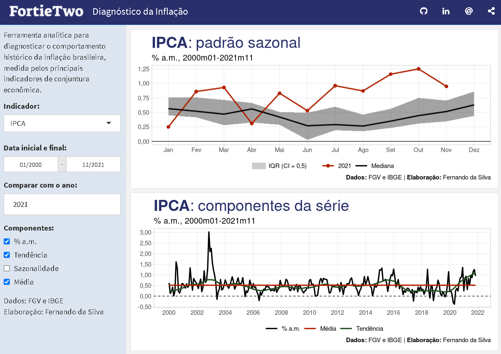

<!-- README.md is generated from README.Rmd. Please edit that file -->

## dash\_inflation

<!-- badges: start -->

<!-- badges: end -->

**dash\_inflation** is a ShinyApps dashboard for analyzing inflation
data for Brazil, built entirely in `R`. This repository periodically
updates the data using GitHub Actions and deploys to shinyapps.io.

You can access the dashboard through this link:
<https://schoulten.shinyapps.io/dash_inflation/>

Currently, the following inflation indicators are available for
analysis:

-   IPCA
-   IGP-M
-   IGP-DI
-   INPC
-   IPC-Br

### Report bugs

If you find any errors or have suggestions, feel free to create a [new
issue](https://github.com/schoulten/dash_inflation/issues) or contact
me: <fernando@fortietwo.com>

### Next steps

-   Add more indicators
-   Add more graphics/analysis
